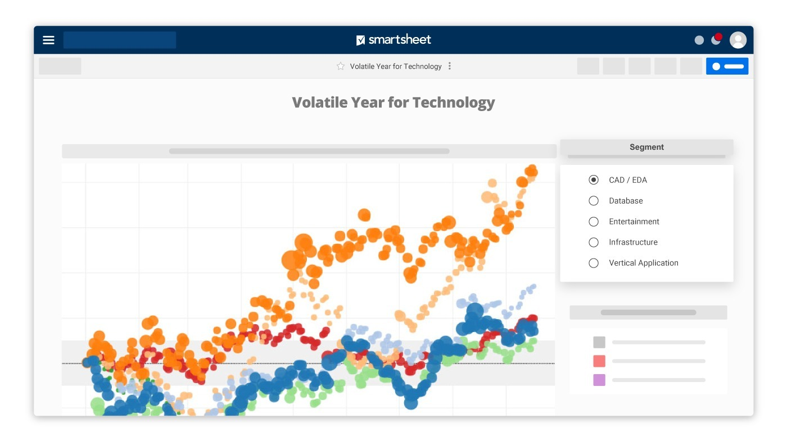

# 5.5-Project-Data-viz

## *OVERVIEW*

The goal of this repo is using database , to create a coherent story. 

We are able to use any data viz tool, like tableu, powerBI and even python.

[POWERBI](https://powerbi.microsoft.com/en-au/),
[TABLEU](https://www.tableau.com/)

## *Technical requirement*

    1) A dasboard or presentation with a story displayed in several pages.
    2) You should also include a README.md file that describes the steps you took and your thought process as you built your data pipeline.

## *Whats inside*
    1) Inside this folder you can find a series of tables in sql format, we will be using these for our data viz.
    2) This read me in markdown format.
    3) Every data viz we will be making.
    4) Some images for the tableu presentation.

## *What i was able to do*

- [x] Conect to Google cloud
- [x] Find a investigate a dataset 
- [x] Query tables 
- [x] Clean dataset
- [x] Make Dashboards
- [x] Create a coherent story
- [x] Make an issue on github
- [x] Present project

## *Story*

By analyizing a dataset of natality in the USA, i was able to create to construct aseries of innsights and view possible risk factores pertaing not only to the current sitaucion but also predict future predicaments we might face.

first i viewed what percentile by state, conformed the population and did an analytical map to view where the death of on born babies was highest.

After i created a dashboard to see what age was it best to have children. Finding that the sweet spot is between 20 - 30.

